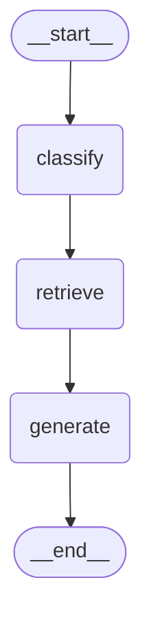

# 状态调试与可视化

调试 LangGraph 应用时，理解状态如何流转是关键。本篇介绍 LangSmith 追踪、日志记录、Mermaid 可视化等调试手段。

---

## 调试手段总览

```
┌───────────────────────────────────────────────┐
│           LangGraph 调试工具箱                  │
├───────────────┬───────────────────────────────┤
│  LangSmith    │ 全链路追踪、可视化、性能分析     │
│  (推荐)       │                               │
├───────────────┼───────────────────────────────┤
│  print 日志   │ 简单直接、开发阶段快速调试       │
├───────────────┼───────────────────────────────┤
│  Mermaid 图   │ 可视化图拓扑结构               │
├───────────────┼───────────────────────────────┤
│  状态快照     │ 查看每一步的状态值              │
├───────────────┼───────────────────────────────┤
│  stream 模式  │ 实时查看执行过程               │
├───────────────┼───────────────────────────────┤
│  断点调试     │ interrupt + 状态检查           │
└───────────────┴───────────────────────────────┘
```

---

## LangSmith 追踪

### 配置

```python
import os

os.environ["LANGSMITH_TRACING"] = "true"
os.environ["LANGSMITH_API_KEY"] = "your-api-key"
os.environ["LANGSMITH_PROJECT"] = "langgraph-debug"

# 之后所有 graph.invoke() / graph.stream() 都会自动追踪
```

### 查看追踪

配置后，每次执行都会在 [smith.langchain.com](https://smith.langchain.com) 留下记录：

```
LangSmith 追踪页面显示:
┌──────────────────────────────────────────┐
│  Trace: graph.invoke()                    │
│  ├─ Step 1: [START]                       │
│  ├─ Step 2: retrieve                      │
│  │   ├─ 输入: {question: "..."}            │
│  │   ├─ 向量检索 (耗时: 120ms)             │
│  │   └─ 输出: {docs: [...]}                │
│  ├─ Step 3: generate                      │
│  │   ├─ 输入: {docs: [...], question: ...} │
│  │   ├─ LLM 调用 (耗时: 850ms, 234 tokens) │
│  │   └─ 输出: {answer: "..."}              │
│  └─ Step 4: [END]                         │
│                                           │
│  总耗时: 1023ms  总 Token: 567             │
└──────────────────────────────────────────┘
```

### 追踪内容

| 信息 | 说明 |
|------|------|
| 节点执行顺序 | 每个节点的调用顺序 |
| 输入/输出 | 每个节点的完整输入和输出 |
| LLM 详情 | Prompt、Response、Token数、耗时 |
| 工具调用 | 工具名、参数、结果 |
| 状态快照 | 每步执行后的状态 |
| 错误信息 | 异常的完整堆栈 |
| 性能指标 | 每步耗时、总耗时 |

---

## Print 日志调试

### 基本日志

```python
def retrieve(state: State) -> dict:
    print(f"[retrieve] 输入问题: {state['question']}")

    docs = vector_store.search(state["question"])

    print(f"[retrieve] 检索到 {len(docs)} 个文档")
    for i, doc in enumerate(docs):
        print(f"  doc[{i}]: {doc.page_content[:50]}... (score: {doc.metadata.get('score')})")

    return {"docs": docs}
```

### 使用 logging 模块

```python
import logging

logging.basicConfig(level=logging.DEBUG, format='%(asctime)s [%(name)s] %(levelname)s: %(message)s')
logger = logging.getLogger("langgraph_app")

def retrieve(state: State) -> dict:
    logger.debug(f"检索输入: {state['question']}")
    docs = vector_store.search(state["question"])
    logger.info(f"检索完成: {len(docs)} 个文档")
    return {"docs": docs}

def generate(state: State) -> dict:
    logger.debug("开始生成答案")
    try:
        response = llm.invoke(...)
        logger.info("生成成功")
        return {"answer": response.content}
    except Exception as e:
        logger.error(f"生成失败: {e}")
        raise
```

### 回调日志

```python
from langchain_core.trachers.context import tracing_context_var

class DebugCallback(BaseCallbackHandler):
    def on_llm_start(self, serialized, prompts, **kwargs):
        logger.debug(f"LLM 开始: {serialized.get('name', 'unknown')}")

    def on_llm_end(self, response, **kwargs):
        tokens = response.llm_output.get("token_usage", {})
        logger.debug(f"LLM 完成: {tokens}")

    def on_tool_start(self, serialized, input_str, **kwargs):
        logger.debug(f"工具调用: {serialized.get('name')} | 输入: {input_str}")

# 全局注册
llm.callbacks = [DebugCallback()]
```

---

## Mermaid 可视化

### 生成 Mermaid 图

```python
graph = builder.compile()

# 打印 Mermaid 图
print(graph.get_graph().draw_mermaid())
```

输出：



### 保存为图片

```python
# 需要 install: pip install matplotlib
try:
    png_data = graph.get_graph().draw_mermaid_png()
    with open("graph.png", "wb") as f:
        f.write(png_data)
    print("图已保存为 graph.png")
except Exception as e:
    print(f"无法生成图片: {e}")
```

---

## 状态快照检查

### 查看执行过程中的状态

```python
from langgraph.checkpoint.memory import MemorySaver

memory = MemorySaver()
graph = builder.compile(checkpointer=memory)

config = {"configurable": {"thread_id": "debug-1"}}
graph.invoke(input, config=config)

# === 方法一：查看当前状态 ===
state = graph.get_state(config)
print("当前状态:")
print(f"  Values: {state.values}")
print(f"  Next: {state.next}")
print(f"  Step: {state.metadata.get('step')}")

# === 方法二：查看完整历史 ===
print("\n状态历史:")
for snapshot in graph.get_state_history(config):
    step = snapshot.metadata.get("step", 0)
    keys = list(snapshot.values.keys())
    next_nodes = snapshot.next
    print(f"  Step {step}: keys={keys}, next={next_nodes}")
```

### 格式化输出状态

```python
def print_state(state_snapshot, title=""):
    """格式化打印状态"""
    print(f"\n{'='*60}")
    if title:
        print(f"  {title}")
    print(f"{'='*60}")

    values = state_snapshot.values
    for key, value in values.items():
        if key == "messages":
            print(f"  {key}: [{len(value)} messages]")
            for msg in value[-3:]:  # 只显示最近3条
                content = msg.content[:80] if hasattr(msg, 'content') else str(msg)[:80]
                print(f"    [{msg.type if hasattr(msg, 'type') else '?'}] {content}...")
        elif isinstance(value, list):
            print(f"  {key}: [{len(value)} items]")
        elif isinstance(value, str):
            preview = value[:100] + "..." if len(value) > 100 else value
            print(f"  {key}: \"{preview}\"")
        else:
            print(f"  {key}: {value}")

    if state_snapshot.next:
        print(f"  → Next: {state_snapshot.next}")

# 使用
state = graph.get_state(config)
print_state(state, "当前状态")
```

---

## Stream 调试模式

### updates 模式

```python
print("=== 逐步执行 ===")
for event in graph.stream(input, config=config, stream_mode="updates"):
    for node_name, update in event.items():
        print(f"\n[{node_name}] 返回:")
        for key, value in update.items():
            if key == "messages":
                print(f"  {key}: +{len(value)} new messages")
                last = value[-1]
                print(f"    Latest: {last.content[:80]}...")
            else:
                print(f"  {key}: {value}")
```

### debug 模式

```python
for event in graph.stream(input, stream_mode="debug"):
    event_type = event.get("type")
    payload = event.get("payload", {})

    if event_type == "task":
        node = payload.get("name", "?")
        print(f"\n▶ 开始执行: {node}")

    elif event_type == "task_result":
        node = payload.get("name", "?")
        result_keys = list(payload.get("result", {}).keys())
        print(f"✔ 完成: {node} → {result_keys}")
```

---

## 断点调试

### 使用 interrupt 进行断点

```python
graph = builder.compile(
    checkpointer=MemorySaver(),
    interrupt_before=["critical_node"]
)

config = {"configurable": {"thread_id": "debug"}}

# 执行到 critical_node 前暂停
result = graph.invoke(input, config=config)

# 检查暂停时的状态
state = graph.get_state(config)
print(f"暂停在: {state.next}")
print(f"当前状态: {state.values}")

# 可以手动检查和修改
# ...

# 检查完毕后继续
result = graph.invoke(None, config=config)
```

### 条件断点

```python
def check_before_critical(state: State) -> dict:
    """在关键节点前检查"""
    state_snapshot = graph.get_state(config)

    # 验证状态是否符合预期
    if not state_snapshot.values.get("retrieved_docs"):
        print("⚠️ 警告: 没有检索到文档!")
        # 可以选择中断或修改

    return {}
```

---

## 常见调试场景

### 场景一：Agent 无限循环

```python
# 问题: Agent 不断调用工具，不停止

# 调试步骤:
# 1. 设置较低的 recursion_limit
result = graph.invoke(
    input,
    config={"recursion_limit": 10}  # 只允许10步
)

# 2. 用 stream 查看每步
for event in graph.stream(input, stream_mode="updates"):
    print(event)  # 看看 LLM 为什么一直选择调用工具

# 3. 检查路由条件
def should_continue(state):
    last_msg = state["messages"][-1]
    print(f"Tool calls: {last_msg.tool_calls}")  # 检查工具调用
    if last_msg.tool_calls:
        print(f"  → 继续调用工具")
        return "tools"
    print(f"  → 结束")
    return END
```

### 场景二：状态不更新

```python
# 问题: 节点返回了值，但状态没变

# 检查1: 是否用了正确的 reducer
class State(TypedDict):
    docs: list  # ❌ 没有 Annotated reducer，会覆盖

# 修复:
class State(TypedDict):
    docs: Annotated[list, operator.add]  # ✅ 有 reducer

# 检查2: 返回的字段名是否匹配
def node(state):
    return {"answer": "..."}  # 确保 key 名字正确

# 检查3: 用 get_state 确认
state = graph.get_state(config)
print(state.values)  # 看实际状态
```

### 场景三：性能问题

```python
# 问题: 执行很慢

# 1. 用 LangSmith 查看每步耗时
# 2. 用计时器
import time

def timed_node(state):
    start = time.time()
    # ... 处理逻辑
    elapsed = time.time() - start
    if elapsed > 1.0:
        logger.warning(f"节点耗时 {elapsed:.2f}s")
    return result
```

---

## 小结

| 工具 | 适用场景 | 推荐度 |
|------|----------|--------|
| **LangSmith** | 全链路追踪、生产监控 | ⭐⭐⭐⭐⭐ |
| **print/logging** | 快速本地调试 | ⭐⭐⭐⭐ |
| **Mermaid 图** | 理解图结构 | ⭐⭐⭐⭐ |
| **状态快照** | 检查状态值 | ⭐⭐⭐⭐⭐ |
| **stream updates** | 实时执行过程 | ⭐⭐⭐⭐ |
| **interrupt 断点** | 关键节点检查 | ⭐⭐⭐⭐ |
| **recursion_limit** | 防止无限循环 | ⭐⭐⭐⭐⭐ |

---

## 下一篇

➡️ 前往 [04-高级控制篇](../04-高级控制篇/01-条件分支与动态路由.md)
